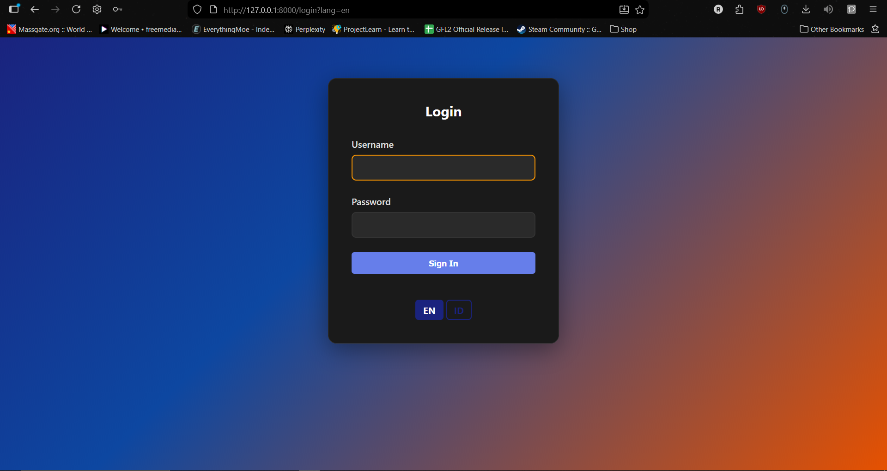
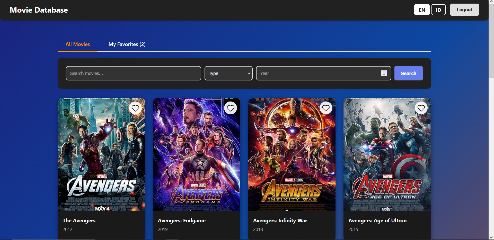
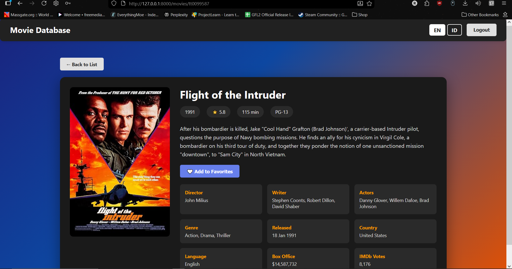
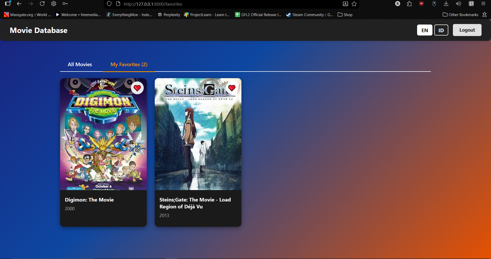

# 🎬 Movie Database - Laravel Application

A full-featured movie database web application built with Laravel 12, featuring OMDb API integration, multi-language support, and a modern dark-themed UI.

## 📸 Screenshots

### Login Page

*Secure login page with multi-language support (EN/ID)*

### Movies List

*Browse movies with infinite scroll and lazy loading*

### Movie Detail

*Comprehensive movie information with ratings, cast, and crew*

### Favorites

*Manage your favorite movies collection*

---

##  Features

- **User Authentication** - Custom session-based login system
- **Movie Search** - Search movies by title, type, and year
- **Movie Details** - View comprehensive information from OMDb API
- **Favorites Management** - Add and remove movies from favorites
- **Multi-Language** - Support for English and Indonesian
- **Infinite Scroll** - Seamless loading of movie results
- **Lazy Loading** - Optimized image loading for better performance
- **Responsive Design** - Mobile-friendly interface
- **Dark Theme** - Modern blue and orange gradient design

---

##  Tech Stack

### Backend
- **Laravel 12** - PHP web application framework
- **PHP 8.4** - Server-side scripting language
- **MySQL** - Relational database management system

### Frontend
- **Blade Templates** - Laravel's templating engine
- **Vanilla JavaScript** - For interactive features
- **CSS3** - Custom styling with gradient themes

### External APIs
- **OMDb API** - The Open Movie Database API for movie data

---

##  Libraries & Dependencies

### PHP/Laravel Dependencies
```json
{
    "laravel/framework": "^12.0",
    "php": "^8.4.8",
    "guzzlehttp/guzzle": "^7.8"
}
```

### Key Laravel Features Used
- **Eloquent ORM** - Database interactions
- **Blade Components** - Reusable UI components
- **HTTP Client** - API requests to OMDb
- **Session Management** - User authentication state
- **Localization** - Multi-language support
- **Middleware** - Route protection and locale switching

### JavaScript Features
- **Intersection Observer API** - Lazy loading and infinite scroll
- **Fetch API** - AJAX requests for favorites
- **Event Delegation** - Efficient event handling

---

##  Architecture

### MVC Pattern
This application follows the **Model-View-Controller (MVC)** architectural pattern:

#### **Models**
- `Favorite.php` - Eloquent model for favorites table
  - Manages favorite movies stored in database
  - Fields: `imdb_id`, `title`, `year`, `poster`

#### **Views (Blade Templates)**
```
resources/views/
├── layouts/
│   └── app.blade.php          # Main layout template
├── auth/
│   └── login.blade.php        # Login page
├── movies/
│   ├── index.blade.php        # Movies listing
│   └── show.blade.php         # Movie detail
└── favorites/
    └── index.blade.php        # Favorites page
```

#### **Controllers**
```
app/Http/Controllers/
├── AuthController.php         # Authentication logic
├── MovieController.php        # Movie browsing and search
└── FavoriteController.php     # Favorites management
```

### Middleware
```
app/Http/Middleware/
├── CheckLogin.php             # Authentication guard
└── SetLocale.php              # Language switching
```

### Routes Structure
```php
// Public routes
GET  /                         → Redirect to login
GET  /login                    → Show login form
POST /login                    → Process login

// Protected routes (auth.custom middleware)
GET  /movies                   → List movies
GET  /movies/search            → Search movies (with pagination)
GET  /movies/{id}              → Show movie detail
GET  /favorites                → List favorites
POST /favorites                → Add/remove favorite
DELETE /favorites/{id}         → Remove favorite
POST /logout                   → Logout user
```

### Database Schema

#### **favorites** table
| Column     | Type         | Description           |
|------------|--------------|-----------------------|
| id         | BIGINT       | Primary key           |
| imdb_id    | VARCHAR(255) | Movie ID from OMDb    |
| title      | VARCHAR(255) | Movie title           |
| year       | VARCHAR(255) | Release year          |
| poster     | TEXT         | Poster image URL      |
| created_at | TIMESTAMP    | Creation timestamp    |
| updated_at | TIMESTAMP    | Last update timestamp |

---

##  API Integration

### OMDb API
The application integrates with [The Open Movie Database (OMDb) API](http://www.omdbapi.com/) to fetch movie data.

#### API Endpoints Used
- **Search Movies**: `/?apikey={key}&s={query}&type={type}&y={year}&page={page}`
- **Get Movie Details**: `/?apikey={key}&i={imdb_id}&plot=full`

#### API Features
- Movie search by title
- Filter by type (movie/series)
- Filter by year
- Pagination support
- Full plot details
- Cast and crew information
- Ratings (IMDb, Metascore)

---

##  Design Patterns

### 1. **Repository Pattern** (Implicit)
Controllers interact with models and external APIs, abstracting data access logic.

### 2. **Dependency Injection**
Laravel's service container automatically injects dependencies into controllers.

### 3. **Service Pattern**
OMDb API calls are centralized in controllers with reusable methods.

### 4. **Observer Pattern**
JavaScript Intersection Observer for lazy loading and infinite scroll.

### 5. **Strategy Pattern**
Multi-language support through Laravel's localization system.

---

##  Installation

### Prerequisites
- PHP 8.2 or higher
- Composer
- MySQL 5.7+ or MariaDB
- Node.js & NPM (optional)

### Setup Steps

1. **Clone the repository**
```bash
git clone <https://github.com/RakhaAS29/Movie-Database-Website.git>
cd movie-database
```

2. **Install dependencies**
```bash
composer install
```

3. **Configure environment**
```bash
cp .env.example .env
php artisan key:generate
```

4. **Configure database**
Edit `.env` file:
```env
DB_CONNECTION=mysql
DB_HOST=127.0.0.1
DB_PORT=3306
DB_DATABASE=movie_db
DB_USERNAME=root
DB_PASSWORD=
```

5. **Add OMDb API Key**
Get your free API key from [OMDb API](http://www.omdbapi.com/apikey.aspx)
```env
OMDB_API_KEY=(API Key here)
```

6. **Create database**
```sql
CREATE DATABASE movie_db;
```

7. **Run migrations**
```bash
php artisan migrate
```

8. **Start development server**
```bash
php artisan serve
```

9. **Access the application**
Open browser: `http://localhost:8000`

**Login Credentials:**
- Username: `aldmic`
- Password: `123abc123`

---

##  Multi-Language Support

The application supports two languages:

### Language Files
```
resources/lang/
├── en/
│   └── messages.php    # English translations
└── id/
    └── messages.php    # Indonesian translations
```

### Switching Languages
Users can switch languages using the language selector in the header (EN/ID buttons).

### Implementation
- Language stored in session
- `SetLocale` middleware handles language switching
- Blade templates use `__('messages.key')` for translations

---

##  Key Features Implementation

### 1. **Infinite Scroll**
```javascript
// Intersection Observer watches trigger element
// Loads next page when user scrolls near bottom
const scrollObserver = new IntersectionObserver((entries) => {
    if (entry.isIntersecting && !loading && hasMore) {
        loadMoreMovies();
    }
});
```

### 2. **Lazy Loading**
```javascript
// Images load only when entering viewport
// Improves initial page load performance
const imageObserver = new IntersectionObserver((entries) => {
    if (entry.isIntersecting) {
        img.src = img.dataset.src;
    }
});
```

### 3. **AJAX Favorites**
```javascript
// Add/remove favorites without page reload
// Smooth animations and instant feedback
fetch(form.action, { method: 'POST', body: formData })
    .then(response => response.json())
    .then(data => updateUI(data));
```

---

##  Project Structure

```
movie-database/
├── app/
│   ├── Http/
│   │   ├── Controllers/
│   │   │   ├── AuthController.php
│   │   │   ├── MovieController.php
│   │   │   └── FavoriteController.php
│   │   └── Middleware/
│   │       ├── CheckLogin.php
│   │       └── SetLocale.php
│   └── Models/
│       └── Favorite.php
├── bootstrap/
│   └── app.php
├── config/
├── database/
│   └── migrations/
│       └── xxxx_create_favorites_table.php
├── public/
├── resources/
│   ├── lang/
│   │   ├── en/messages.php
│   │   └── id/messages.php
│   └── views/
│       ├── layouts/app.blade.php
│       ├── auth/login.blade.php
│       ├── movies/
│       │   ├── index.blade.php
│       │   └── show.blade.php
│       └── favorites/
│           └── index.blade.php
├── routes/
│   └── web.php
├── .env
├── composer.json
└── README.md
```

---

##  Deployment

### Railway.app
1. Push code to GitHub
2. Connect repository to Railway
3. Add environment variables
4. Deploy automatically

---

##  Testing

### Manual Testing Checklist
- [ ] Login with correct credentials
- [ ] Login with incorrect credentials (error message)
- [ ] Search movies by title
- [ ] Filter by type and year
- [ ] Scroll to load more movies (infinite scroll)
- [ ] Click movie to view details
- [ ] Add movie to favorites
- [ ] Remove movie from favorites
- [ ] View favorites page
- [ ] Switch language (EN/ID)
- [ ] Logout

---

##  License

This project is created for educational purposes.

---

##  Author

Developed as a Job Application assessment project.

---

##  Acknowledgments

- **OMDb API** - Movie data provider
- **Laravel Framework** - PHP framework

---
